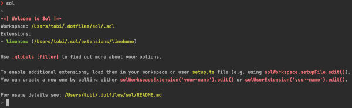
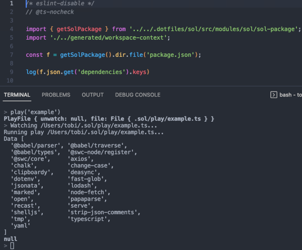

# Welcome to Sol



A set of tools orbiting around a common goal:
To make those boring daily routines a breeze.

And most importantly: It is based on JavaScript / TypeScript.
So you don't need to learn a real shell™ or any fancy syntax.

It is quick and dirty, just like JS.
But it also gets stuff done, just like JS.

In short:
A small, interactive **JavaScript shell** for everybody focusing on simplicity & productivity.

You can do:

```
// Get all TypeScript files in current directory (recursively)
> files('src/**/*.ts')

// Gather all import statements
> let imports = _.map(f => f.text.match(/(?<=^|\n)import[^;]+;/g) || []).flattened

// Open import list in editor
> imports.map(i => i.replace(/\r?\n/g, ' ')).join('\n').edit()

// Get updated imports (_ is the file opened in editor)
> _.text.trimmed.split('\n')

// Get import sources using abstract syntax tree
> _.map(i => ast(i).node.program.body[0].source.value).sorted.unique
```

Or this:

```
// Get todos
> const j = web.fetch('https://jsonplaceholder.typicode.com/todos').content.json

// Get all open ToDos
> const open = j.filter(todo => !todo.completed)

// Show all IDs of users with open ToDos using jsonata expression
> open.get('userId').sort().unique

// Show the number of open ToDos per user as chart in the browser
> open.group(todo => todo.userId).map(group => group.length).chart().html.browse()

// Save open ToDos in CSV
> open.csv.saveAs('todos.csv')

// Open CSV file in editor
> _.edit()
```

Or this:

```
// Fetch Sol README.md file as markdown and save it as `readme` variable
> web.get('https://raw.githubusercontent.com/tobeno/sol/main/README.md').content.md.var('readme')

// Render as HTML and open in browser
> readme.html.saveAs('README.html').browse()

// Ask ChatGPT about how to install Sol
> readme.text.ask('How do I install this?\n---')

// Render answer as HTML and open in browser
> _.answer.md.html.browse()
```

## ⚙️ Install

To use Sol, you need to have NodeJS >= 14 installed globally.

To setup:

1. Install NodeJS >= 16
2. Setup the project
   ```sh
   git clone git@github.com:tobeno/sol.git
   cd sol
   npm i
   ```
3. Symlink or alias the _bin/sol_ file to allow you to run it from anywhere
   ```sh
   # On MacOS, Linux and WSL from inside the sol folder
   ln -s $(pwd)/bin/sol /usr/local/bin/sol
   ```
4. Optional: Define environment variables for Sol (like `SOL_EDITOR`) in a `~/.sol/.env` file

## 🚀 Usage

**Start** the Sol shell using `sol`.

Most features of Sol are available as **global variables** (e.g. `play(...)` or `web.get(...)`).
You can use `.globals [filter]` to list and filter the available global functions.

Sol is heavily focused on **chaining things** together and tries to avoid back & forward jumps when writing commands.
This is similar to what you know of pipes on many shells (e.g. `ls | grep '.json' | xargs cat`). Sol tries it make as
easy as possible to write processing **pipelines**.

So to open a file, interpret as JSON and then extract something, you would use
e.g. `file('package.json').json.get('dependencies').keys`.

You can always **interrupt a pipeline** and execute the command. To resume start with `_` (e.g. `_.join(',')`).

For longer pipelines it is best to also use **variables**.
This ensures you wont loose a result when switching between pipelines.

So you can use all of those:

```
// Assign before writing the pipeline
> let someVariable = text('abc')
> someVariable.value

// Assign after writing the pipeline (most wrappers support .var() out of the box)
> text('abc').var('someVariable')
> someVariable.value

// Interrupt pipeline without assignment
> text('abc')
> _.value
```

The **final result** of a command / pipeline is printed on the shell (e.g. `['a', 'b'].join(', ')` will show `a, b`).

Other than NodeJS, Sol is mostly **synchronous**.
So even commands like `fetch(...)` are executed synchronously.

If you want to use a **Promise-based method**, you can make it synchronous by either using `awaitSync(someAsyncFn())` or
by using the await helper method `someAsyncFn().await` available on Promises.

Sol is based on the [NodeJS REPL](https://nodejs.org/api/repl.html),
so all REPL features are available.

The most important ones are:

- You can access the **previous command result** using `_`
- It has a command **history** available (stored in _./.sol/history_)
  - You can **search** this history using Control + R (on MacOS)
- You can **autocomplete** using TAB
- To **exit** the shell either enter `.exit` or press Control + C twice

### Workspaces

Sol is based around the concept of **workspaces**.
By default a _.sol_ subdirectory in the current working directory is used as workspace.

This workspace contains a setup file (_.sol/setup.ts_) as well as workspace specific extensions (_.sol/extensions/_).

In addition to the workspace, there is also a global config directory in your home directory (_~/.sol_). This directory
is intended for global things which are shared across workspaces.

### Play / Edit

To use your favorite _IDE_ for scripting, use the `play('somename')` command.

This opens a new or existing play file (located in your workspace directory) in your IDE.
In this file you can use the same globals you also use on the sell itself.

Whenever you **save** this file, Sol will **automatically execute** it.
Keep this in mind when using an editor with auto-save. Best to disable that feature for Sol.

Besides that you can also open a file for editing using the `playFile('somefile').edit()` command.
With that command the file will only be opened but not watched.

By default play tries the _visual studio code_ app on the command line,
but you can also set the _SOL_EDITOR_ environment variable to another editor of your choice (
e.g. `export SOL_EDITOR=webstorm`).



### Extensions

Extensions are **additional features** that can be loaded into Sol.
In the end they are just **JavaScript files** which are directly loaded by Sol.

They are **enabled** using your workspace or user setup file.

**Important:** As all extensions have full access to the NodeJS environment,
be careful when using third-party extensions not provided by you or Sol.
So only load extensions which you fully trust. Treat them as you would NPM packages.

Every extension must contain a root **setup file** (e.g. _extensions/some-extension/setup.ts_),
which is called when the extension is loaded.

The **directory name** of the extension is also used as **extension name**.
It must be unique in the lookup chain, but you can reuse the same name in different workspaces.

Sol looks for extensions in the following locations:

- Workspace: _./.sol/extensions/_
- Home: _~/.sol/extensions/_

To load an extension, just add a `solExtension('your-extension', __dirname).load()` call to your setup file.
To quickly open the right setup file, you can use `solWorkspace.setupFile.edit()`.

To create a new extension, you can use `solWorkspaceExtension('your-extension').edit()` to create a new workspace
extension
or `solUserExtension('your-extension').edit()` to create a new user level extension.

After the creation you still need to load the extension as described above.

### Combinations

Sol can also be used with other CLI tools.

#### Use Command Output

Option 1: You can pass in results of other commands as arguments:

```
// In your shell pass the result of a command as argument
> sol -- $(echo 'test')

// In Sol access the output via the `args` global
> args.get(0).uppercased
```

Option 2: Run the command inside Sol:

```
// Run the command and work with the result
> sh.exec('echo "test"').uppercased
```

## 💻 Development

### Install

To get started simply run `npm install`.

### Update

To do a full update of Sol from GitHub, you can use `.update`.
